# JWS Weighing Software

The JWS Weighing Software website is a site where visitors will learn about the versatility of our weighing software and uses in multiple industries and multiple pieces of equipment. It will provide the user with the suitability of our range of corresponding indicators or control systems that will best reflect their requirements. The website will also provide examples of how we intend to implement the desired solution, how we would support them post installation and testimonials from previous customers. Finally, it will allow the prospective client to fill their details into a form and submit for future contact.

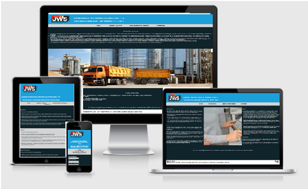

<strong><u>STRATEGY</u></strong>

Focus - What’s worth doing? 
A site where a user can gain insight into what software can be available for their application and guide them into making the correct with JWS Software.  
Definition - What are we creating? 
Creating an intuitive way that a client can easily navigate through different software options to narrow down on their specific industry and product requirements and provide their contact details for follow up.
  
Value - What value does it provide? 
It provides the prospective client with information on the capabiltity and broad scope of our sotware and encourages them to engage with the company.

<strong><u>SCOPE</u></strong>

What features will be available? 
A Nav bar to easily move around website. Information on the capability of JWS in different industries and product ranges. A list of different software possibilities for the client to choose from based on their industry and product. Contact us form to fill in requesting further information and a clickable image linking to further JWS media.  
What content will there be? 
On the homepage there will be a detailed description of the industries and products we cover.
The software page will list the different options available to clients dependent on what industry they are in and what equipment they have. The software page will provide information on how we intend to implement the solution and support them post installation. The contact page will allow the user to provide their detail and also provide our own. 

<strong><u>STRUCTURE</u></strong>

How is the user interaction designed? 
There will be a Nav bar taking client to 4 pages Home, Software Solution, Implementation & Services, Contact Us. A form to be filled out requesting further information on the contact page as well as a link to JWS twitter and email address plus phone number for direct contact.  
How will the information architecture look? 
Home page will be split into three sections with industries covered in the first section then a full length image and lastly the products we cover.  The software page will list available solutions vertically depending on the user’s industry and provide a step by step solution. An image at the bottom of the page showcases some of our products. The support page details how the chose solution will be implemented and supported split into two sections and separated by an image. The contact page will have a bold form to fill out as well as JWS contact details and a smaller image at the bottom in order to focus the users attention on the form. A bright header with a large bold motto and logo will be on every page catching the users attention. A small footer with location details finishes every page.

<strong><u>SKELETON</u></strong>

How will the interface be laid out?

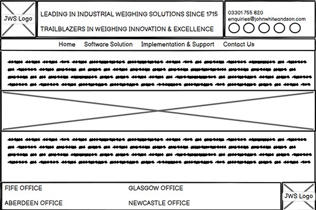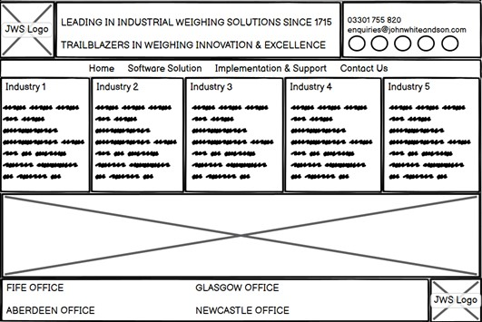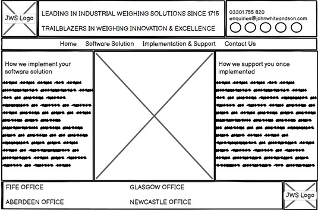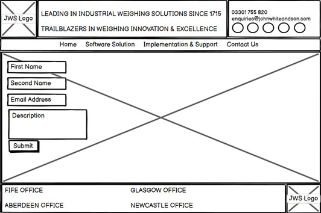

<strong><u>SURFACE</u></strong>

What will the visual design look like? 

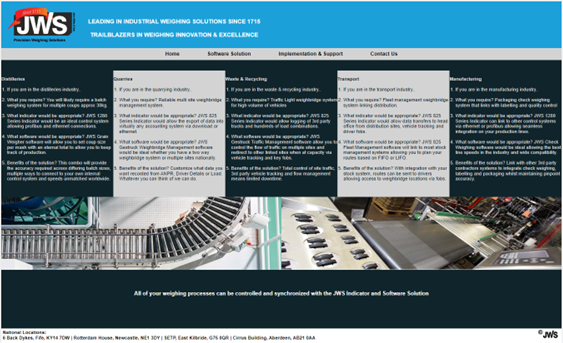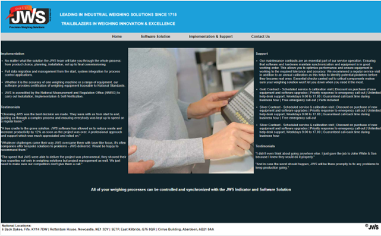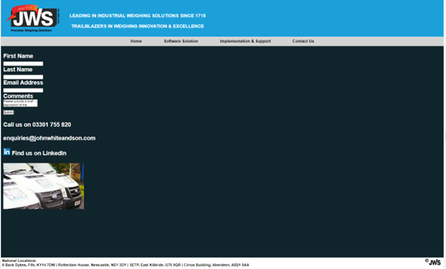

<strong><u>FUTURE RELEASES</u></strong>

What features would you like to have in the future? 
The site would preferably have user interfacing demonstrations where inputs can be mimicked by the user and outputs relayed dependant on the data. It would be visual and reflective of the indicator or control panel and software selected. There would also be more graphics to further explain how the software works and how we would implement the solution. This would allow the client to get a real-world example of how the software would work and the 
process of implementation and support. 

<strong><u>TECHNOLOGY</u></strong>

What technology was used? 
<ul>
<li>Gitpod - writing code on workspace.</li>
<li>Github - hosting repository.</li>
<li>HTML - markup language used to write code.</li>
<li>CSS - style sheet language used to style code.</li>
<li>Chrome Dev Tools - platform used to test contrast and device responsiveness.</li>
<li>Balsamic Wireframes - platform used to sketch out website.</li>
</ul>

<strong><u>TESTING</u></strong>

How was the app tested and are there any bugs that have not been addressed? 
Tested HTML code on https://validator.w3.org/ with no errors or warnings found. 

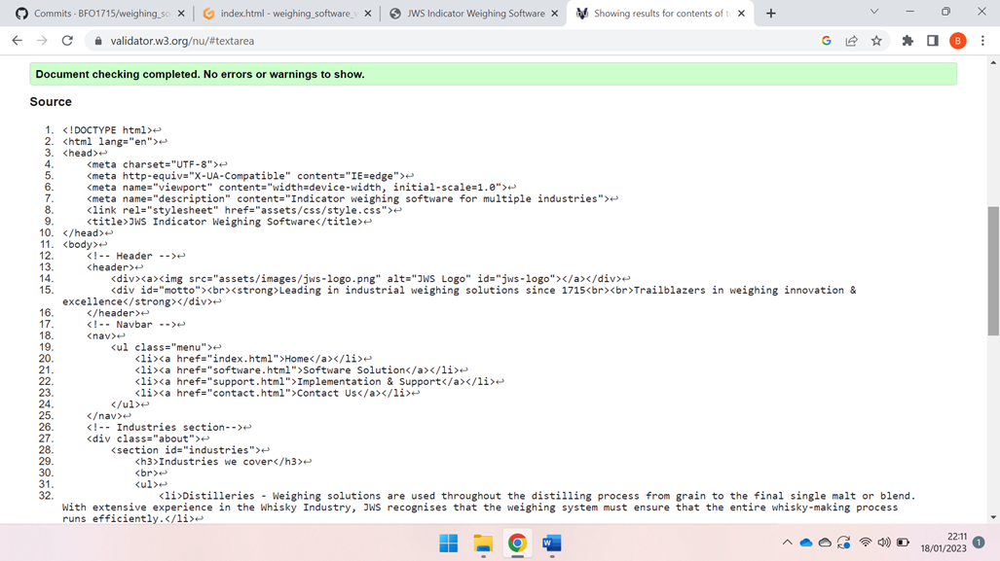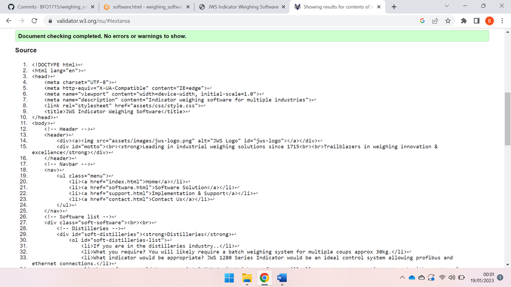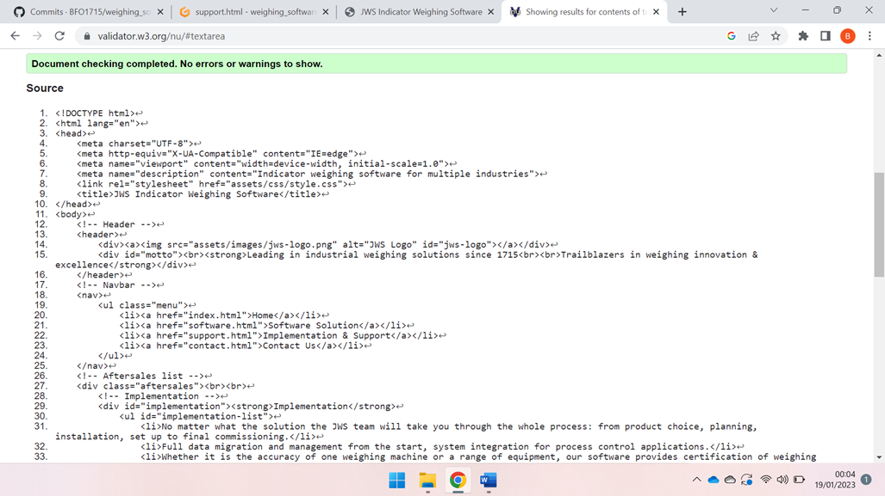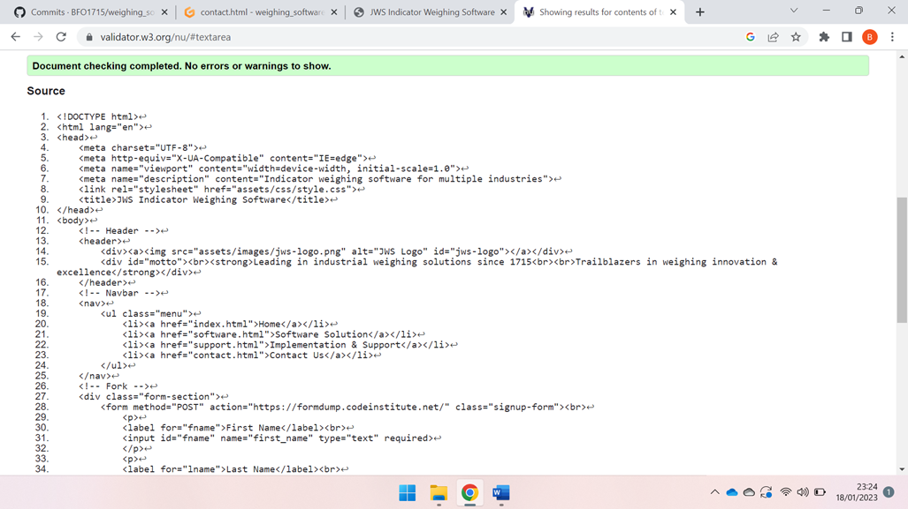

Tested CSS code on https://jigsaw.w3.org/css-validator/ with no errors or warnings found.

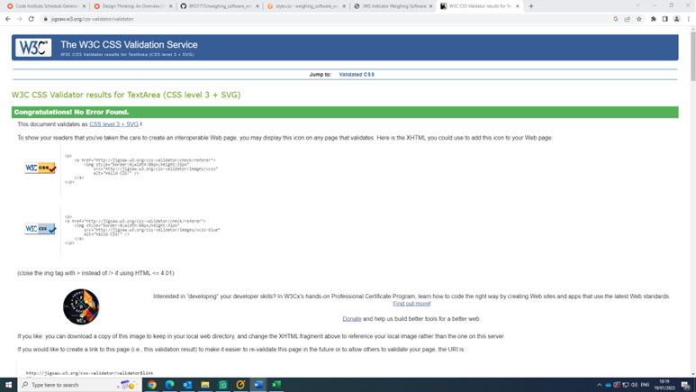

Tested contrast on all pages and sections on Chrome Dev Tools - passed on all content.

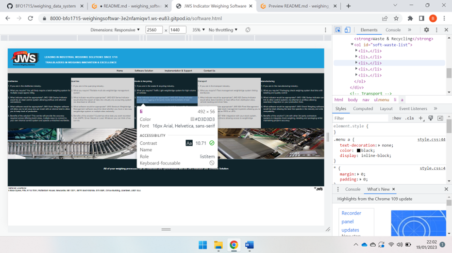

Tested responsiveness for multiple devices on Chrome Dev Tools as shown below:

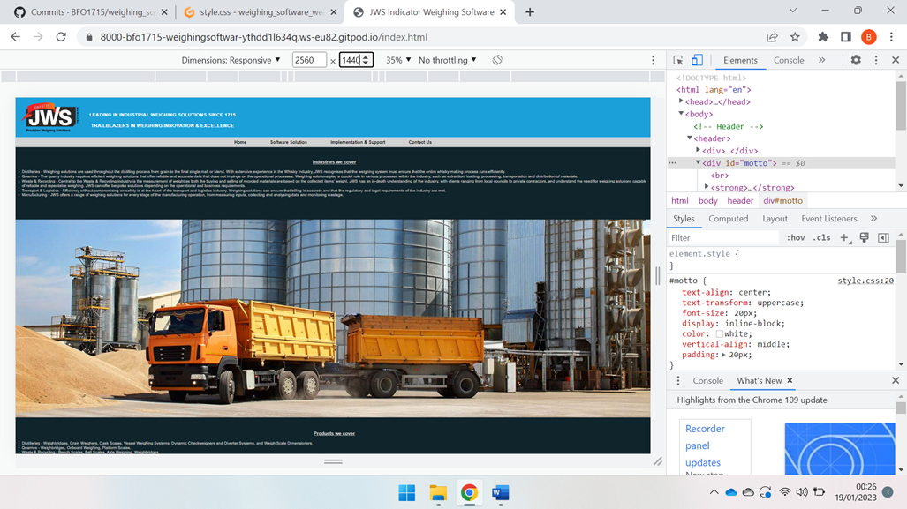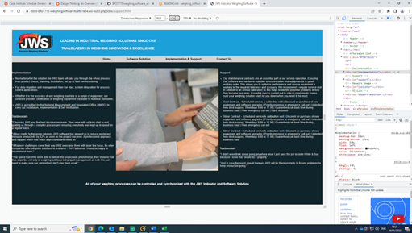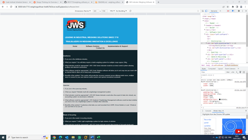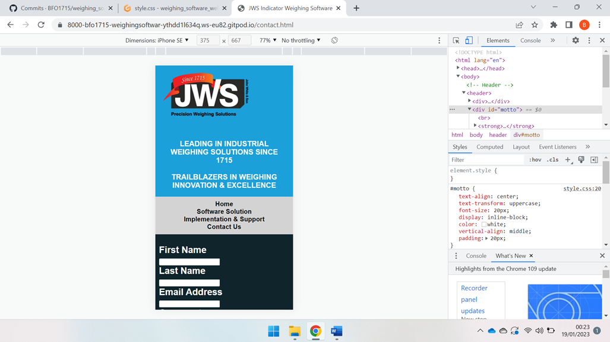

No bugs found in code.

<strong><u>DEPLOYMENT</u></strong>

How was the project deployed? 
The site was deployed to GitHub pages. The steps to deploy are as follows: 
<ul>
<li>In the GitHub repository, navigate to the Settings tab.</li>
<li>Scroll down to the pages option on the left menu and select.</li>
<li>Select the main branch from the build and deployment section.</li>
<li>Once the main branch has been selected and the page is refreshed a message is displayed to indicate the successful deployment.</li>
</ul>

The live link can be found here - https://bfo1715.github.io/weighing_software_website/

<strong><u>CREDITS</u></strong>

Code Institute - https://codeinstitute.net/ 
JWS - https://www.johnwhiteandson.com/ 
Stack Overflow - https://stackoverflow.com/

 

